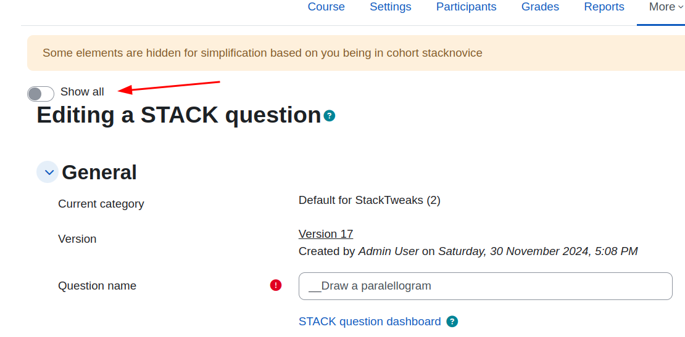
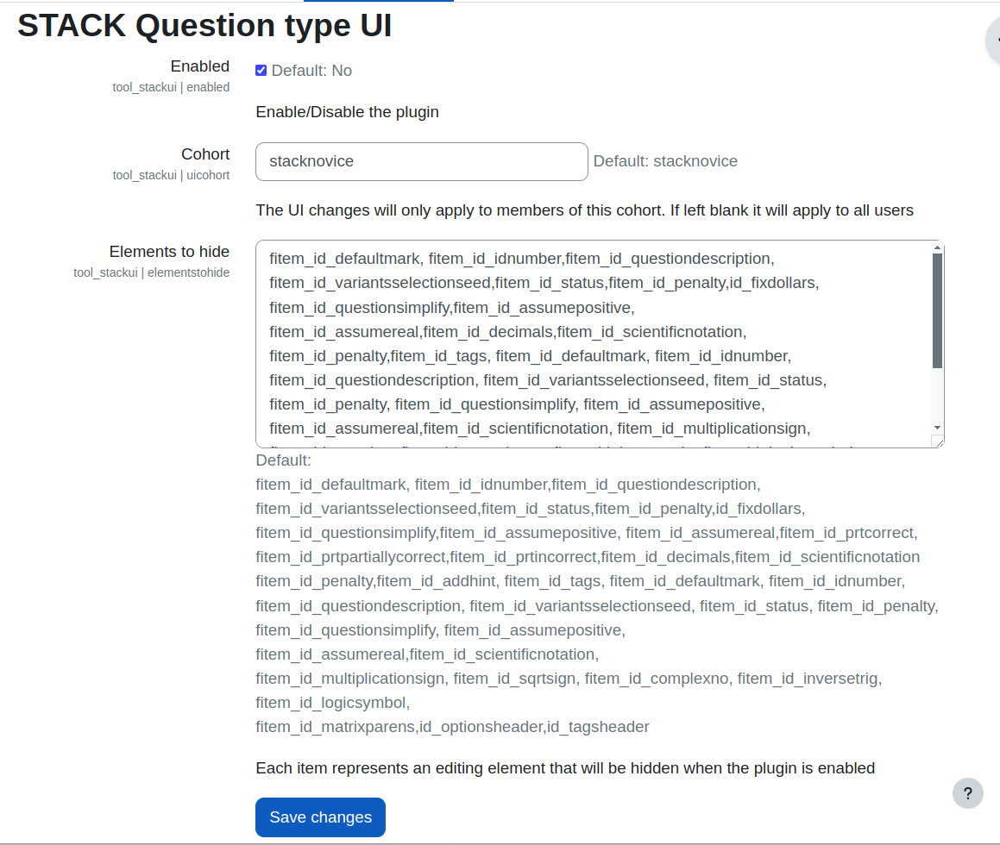

## STACK UI Simplification
This plugin is designed to simplify the editing of STACK Maths related questions by novice authors. You can see more about the  STACK question type here

https://moodle.org/plugins/qtype_stack

It will hide elements of the question editing interface based on configurations in a settings file. It is designed for novice authors of STACK questions who may find the large number of editing options overwhelming. It is possible to toggle for a full view of all fields from within the Question editing interface.

The exact elements that are hidden can be configured in the settings file based on the element id. It comes with a set of pre-defined elements. Using the browser element inspector may identify additional elements.

The plugin will only apply to users who are in a defined cohort (site wide group). This is defined in the settings file and defaults to the name stacknovice. This cohort must be created separatly for the site for the plugin to work.

 View the settings page by visiting Site Administration >Plugins.(/admin/search.php#linkmodules). It can be found in the Admin Tools section.  The plugin is globally disabled on first installation and can be enabled via the Enabled checkbox in settings.

When enabled the user will see a notification at the top of the screen that says "Some elements are hidden for simplification based on you being in cohort stacknovice". (or whatever you have named the cohort).

This plugin was created to test the concept of simplifying the STACK editing interface and there may be a case for integrating this type of functionality into the core STACK editing interface.

This plugin was written by Marcus Green

For Moodle hosting, custom development and consultancy contact Certified Moodle Partner Catalyst EU (https://www.catalyst-eu.net/).

### The settings page

